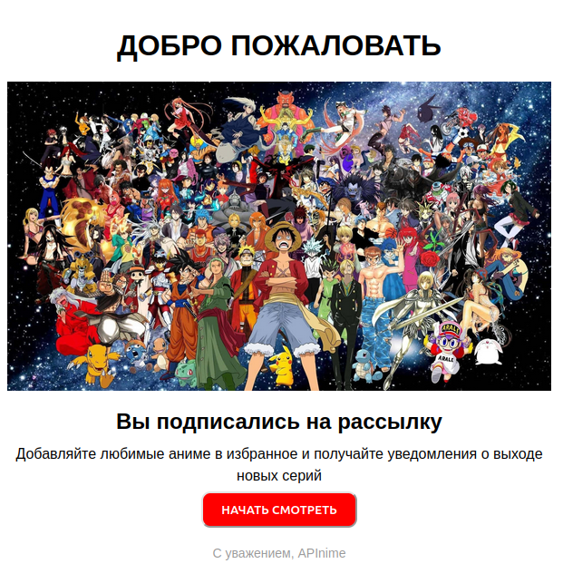
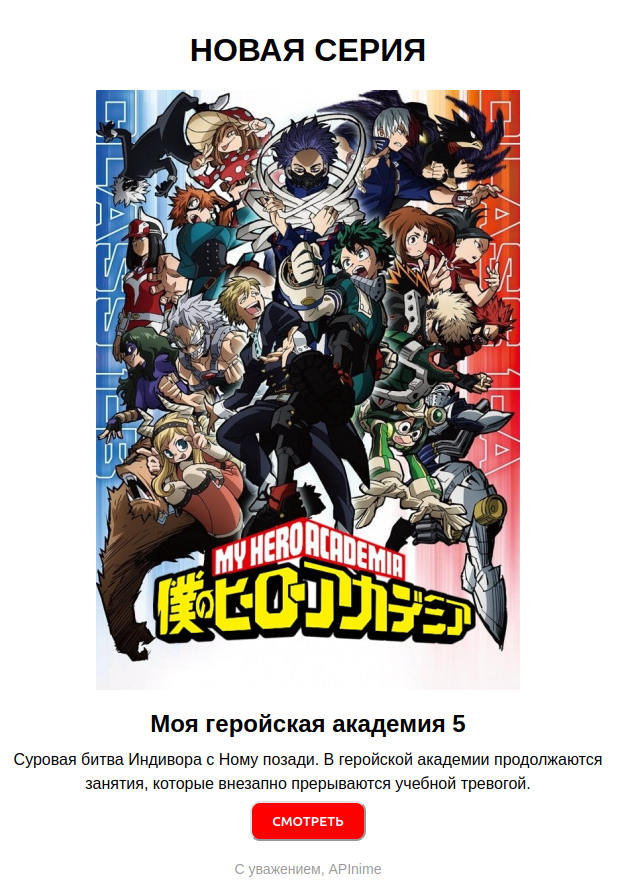

     
    
    
    <h3>
        <storng>APInime</strong> is a web application that allows users to browse and rate anime. It is built using Django and Django REST Framework.
    </h3>

 

## Features

- Registration, authentication and authorization of users using JWT tokens.

- Creating a user profile, updating profile data

- CRUD oprations over anime for administrators.

- List of anime with the ability to filter or ordering by some fields, the ability to get video files of series.

- Receive email notifications when new episodes are released if the user has liked the anime and agreed to receive the newsletter when registering.

- Receive email notifications when creating a user

- Commentary and like system.

    
    and more..

  

## Endpoints

### Create new user

`AllowAny`
~~~
POST /users/signup/ HTTP
data: {
    "email": str,
    "password": str,
    "password2": str,
    "is_subscribed": bool
}
~~~

Example response
~~~
HTTP 201 CREATED
~~~
~~~JSON
{
    "email": "your email",
    "is_subscribed": "is subscribed"
}
~~~

 

### Get JWT token

`IsAuthenticated`
~~~
POST /users/token/ HTTP
data: {
    "email": str,
    "password": str
}
~~~

Example response
~~~
HTTP 200 OK
~~~
~~~JSON
{
    "refresh": "str",
    "access": "str"
}
~~~

 

### Refresh token

`IsAuthenticated`
~~~
POST /users/token/refresh/ HTTP
data: {
    "refresh": str
}
~~~

Example response
~~~
HTTP 200 OK
~~~
~~~JSON
{
    "access": "str",
    "refresh": "str"
}
~~~

 

### Get anime list 

`IsAdminOrReadOnly`
~~~
GET /anime/ HTTP
~~~

Example response
~~~
HTTP 200 OK
~~~
~~~JSON
[
    {
        "id": 0,
        "rating": 0.0,
        "views": 0,
        "likes_count": 0,
        "sudio": {
            "id": 0,
            "slug": "string"
        },
        "genres": [
            {
                "id": 0,
                "name": "string"
            }
        ],
        "title": "string",
        "alt_title": "string",
        "description": "string",
        "type": "string",
        "date_aired": "2024-05-22",
        "status": "string",
        "duration": "string",
        "cover": "string",
        "slug": "string",
    }
]
~~~
 

### Create new anime
`IsAdminOrReadOnly`

~~~
POST /anime/ HTTP
headers: {
    Authorization: Bearer {your_token}
}
data: {
    **new_anime
}
~~~

Example response
~~~
HTTP 201 CREATED
~~~
~~~JSON
{
    "id": 0,
    "rating": 0.0,
    "views": 0,
    "likes_count": 0,
    "sudio": {
        "id": 0,
        "slug": "string"
    },
    "genres": [
        {
            "id": 0,
            "name": "string"
        }
    ],
    "title": "string",
    "alt_title": "string",
    "description": "string",
    "type": "string",
    "date_aired": "2024-05-22",
    "status": "string",
    "duration": "string",
    "cover": "string",
    "slug": "string",
}

~~~

 

### Get anime detail
`IsAdminOrReadOnly`

~~~
GET /anime/{anime_id}/ HTTP
~~~

Example response
~~~
HTTP 200 OK
~~~
~~~JSON
{
    "id": 0,
    "rating": 0.0,
    "views": 0,
    "likes_count": 0,
    "sudio": {
        "id": 0,
        "slug": "string"
    },
    "genres": [
        {
            "id": 0,
            "name": "string"
        }
    ],
    "title": "string",
    "alt_title": "string",
    "description": "string",
    "type": "string",
    "date_aired": "2024-05-22",
    "status": "string",
    "duration": "string",
    "cover": "string",
    "slug": "string",
}
~~~

 

### Delete anime
`IsAdminOrReadOnly`

~~~
DELETE /anime/{anime_id}/ HTTP
headers: {
    Authorization: Bearer {your_token}
}
~~~

Example response
~~~
HTTP 204 NO CONTENT
~~~

 

### Update anime
`IsAdminOrReadOnly`

~~~
PATH, PUT /anime/{anime_id}/ HTTP
headers: {
    Authorization: Bearer {your_token}
}
data: {
    **new_data
}
~~~

Example response
~~~
HTTP 200 OK
~~~

~~~JSON
{
    "id": 0,
    "rating": 0.0,
    "views": 0,
    "likes_count": 0,
    "sudio": {
        "id": 0,
        "slug": "string"
    },
    "genres": [
        {
            "id": 0,
            "name": "string"
        }
    ],
    "title": "string",
    "alt_title": "string",
    "description": "string",
    "type": "string",
    "date_aired": "2024-05-22",
    "status": "string",
    "duration": "string",
    "cover": "string",
    "slug": "string",
}
~~~

 

### Get anime episodes

`IsAdminOrReadOnly`
~~~
GET /episodes/ HTTP
~~~

Example response
~~~
HTTP 200 OK
~~~

~~~JSON
[
    {
        "id": 0,
        "series_file": "string",
        "series_number": 0,
        "anime_id": 0
    }
]
~~~

 

### Create anime episode

`IsAdminOrReadOnly`
~~~
POST /episodes/ HTTP
headers: {
    Authorization: Bearer {your_token}
}

data: {
    series_file: str,
    series_number: int,
    anime_id: int
}
~~~

Example response
~~~
HTTP 201 CREATED
~~~

~~~JSON
{
    "id": 0,
    "series_file": "string",
    "series_number": 0,
    "anime_id": 0
}
~~~

### Delete anime episode

`IsAdminOrReadOnly`
~~~
DELETE /episodes/{episode_id}/ HTTP
headers: {
    Authorization: Bearer {your_token}
}
~~~

Example response
~~~
HTTP 204 NO CONTENT
~~~

 

### Get comments

`IsAuthenticatedOrReadOnly`
~~~
GET /comments/ HTTP
~~~

Example response
~~~
HTTP 200 OK
~~~

~~~JSON
[
    {
        "id": 0,
        "user": 0,
        "comment_text": "string",
        "date_created": "2024-05-21T19:27:39.436599Z",
        "anime": 0
    }
]
~~~

 

### Create new comment

`IsAuthenticatedOrReadOnly`
~~~
POST /comments/ HTTP
headers: {
    Authorization: Bearer {your_token}
}

data: {
    comment_text: str,
    anime: int
}
~~~

Example response
~~~
HTTP 201 CREATED
~~~

~~~JSON
{
    "id": 0,
    "user": 0,
    "comment_text": "string",
    "date_created": "2024-05-21T19:27:39.436599Z",
    "anime": 0
}
~~~

 

### Get comment detail

`IsAuthenticatedOrReadOnly`
~~~
GET /comments/{comment_id}/ HTTP
~~~

Example response
~~~
HTTP 200 OK
~~~

~~~JSON
{
    "id": 0,
    "user": 0,
    "comment_text": "string",
    "date_created": "2024-05-21T19:27:39.436599Z",
    "anime": 0
}
~~~

 

### Delete comment

`IsAuthenticatedOrReadOnly`
~~~
DELETE /comments/{comment_id}/ HTTP

headers: {
    Authorization: Bearer {your_token}
}
~~~

Example response
~~~
HTTP 204 NO CONTENT
~~~

 

### Update comment

`IsAuthenticatedOrReadOnly`
~~~
PATH, PUT /comments/{comment_id}/ HTTP
headers: {
    Authorization: Bearer {your_token}
}

data: {
    **new_comment
}
~~~

Example response
~~~
HTTP 200 OK
~~~

~~~JSON
{
    "id": 0,
    "user": 0,
    "comment_text": "string",
    "date_created": "2024-05-21T19:27:39.436599Z",
    "anime": 0
}
~~~

 

### Get likes

`IsAuthenticatedOrReadOnly`
~~~
GET /likes/ HTTP
~~~

Example response
~~~
HTTP 200 OK
~~~

~~~JSON
[
    {
        "id": 0,
        "user": 0,
        "like": true,
        "anime": 0
    }
]
~~~

 

### Get like detail

`IsAuthenticatedOrReadOnly`
~~~
GET /likes/{like_id}/ HTTP
~~~

Example response
~~~
HTTP 200 OK
~~~

~~~JSON
{
    "id": 0,
    "user": 0,
    "like": true,
    "anime": 0
}
~~~

 

### Create like

`IsAuthenticatedOrReadOnly`
~~~
POST /likes/ HTTP
headers: {
    Authorization: Bearer {your_token}
}

data: {
    anime: int
}
~~~

Example response
~~~
HTTP 201 CREATED
~~~

~~~JSON
{
    "id": 0,
    "user": 0,
    "like": true,
    "anime": 0
}
~~~

 

### Delete like

`IsAuthenticatedOrReadOnly`
~~~
DELETE /likes/{like_id}/ HTTP
headers: {
    Authorization: Bearer {your_token}
}
~~~

Example response
~~~
HTTP 204 NO CONTENT
~~~

 

### Get profiles

`IsAuthenticatedOrReadOnly`
~~~
GET /users/profiles/ HTTP
~~~

Example response
~~~
HTTP 200 OK
~~~

~~~JSON
[
    {
        "id": 0,
        "profile_pic": "string",
        "desc": 0,
        "user": 0
    }
]
~~~

 

### Get profile detail

`IsAuthenticatedOrReadOnly`
~~~
GET /users/profiles/{profile_id}/ HTTP
~~~

Example response
~~~
HTTP 200 OK
~~~

~~~JSON
{
    "id": 0,
    "profile_pic": "string",
    "desc": 0,
    "user": 0
}
~~~

### Update profile

`IsAuthenticatedOrReadOnly`
~~~
PATCH, PUT /users/profiles/{profile_id}/ HTTP

headers: {
    Authorization: Bearer {your_token}
}

data: {
    **new_profile_data
}
~~~

Example response
~~~
HTTP 200 OK
~~~

~~~JSON
{
    "id": 0,
    "profile_pic": "string",
    "desc": 0,
    "user": 0
}
~~~

  

## Filters

### Anime list

~~~
GET /anime/?filters... HTTP
~~~

- Title contains 

    `?title=my hero`

- By genre 

    `?genres=fantistika&genres=skhola`

- By studio 
    
    `?studio=1`

 

### Episodes list

~~~
GET /episodes/?filters... HTTP
~~~

- By anime 

    `?anime_id=1`

 

### Comment list

~~~
GET /comments/?filters... HTTP
~~~

- By user id

    `?user=1`

- By anime id

    `?anime=14`

 

### Like list

~~~
GET /likes/?filters... HTTP
~~~

- By anime id

    `?anime=6`

- By user id

    `?user=10`

  

## Sortings

### Anime list

~~~
GET /anime/?ordering... HTTP
~~~

- Date aired 

    `?ordering=(-)date_aired`

- Title 

    `?ordering=(-)title`

- Likes count 
    
    `?ordering=(-)likes_count`

 

### Episodes list

~~~
GET /episodes/?ordering... HTTP
~~~

- Series number

    `?ordering=(-)series_number`

 

### Comment list

~~~
GET /comments/?ordering... HTTP
~~~

- Date created

    `?ordering=(-)date_created`

- Comment text

    `?ordering=(-)comment_text`

  

## Signals

### 1. Creating a user profile during registration
### 2. Sending a letter to the user's e-mail when registering

    
Example email message after registration

    

### 3. Sending an email to a user's e-mail when a new episode of his favorite anime is released

    
Example email message about the release of a new episode

    

  
